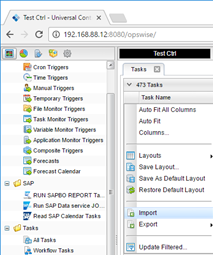
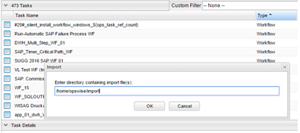
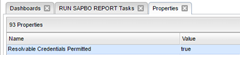
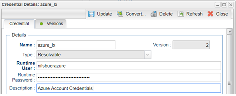
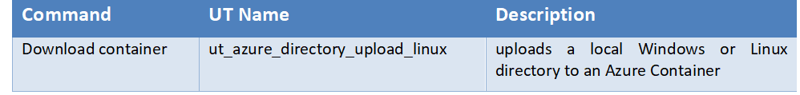
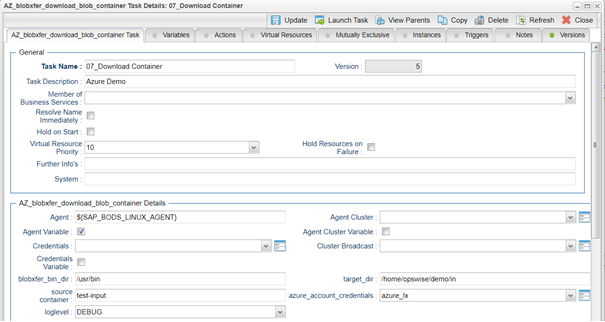
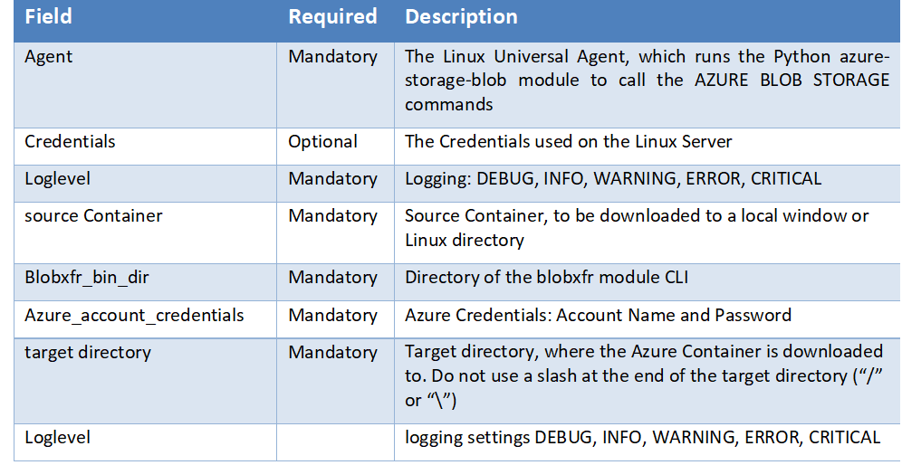
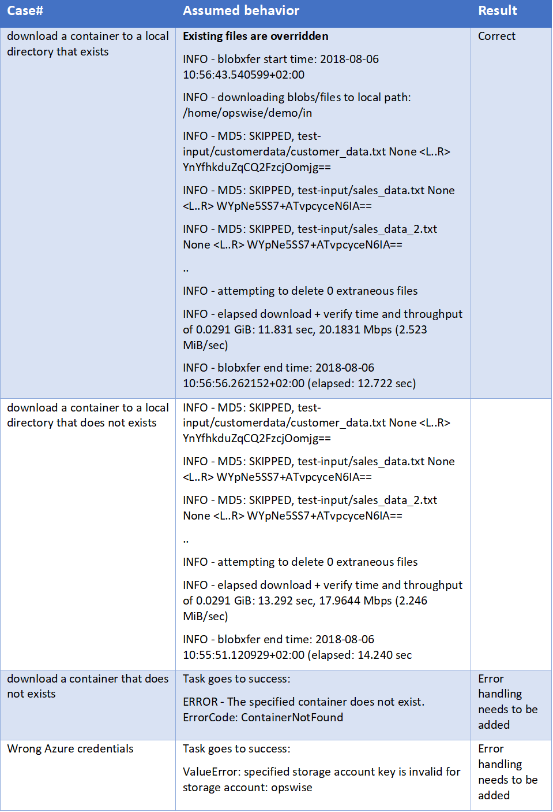

# ut-azure-blobstorage-download-container-linux

# Abstract: 

The here described Universal Tasks downloads an Azure container to a local Windows or Linux directory.  As a result, you can integrate
downloads of an entire Azure container into you existing or new scheduling workflows, providing a true hybrid cloud (on-premise and cloud 
computer) file transfer solution.  

# 1. Disclaimer

No support and no warranty are provided by Stonebranch GmbH for this document and the related Universal Task. The use of this document and 
the related Universal Task is on your own risk.

Before using this task in a production system, please perform extensive testing.

Stonebranch GmbH assumes no liability for damage caused by the performance of the Universal Tasks

# 2.	Scope 

This document provides a documentation how to install and use the Universal Tasks to download an Azure Blob Storage Container to a local 
Linux or Windows directory.   

# 3. 	Introduction

Storing data in the cloud becomes an integral part of most modern IT landscapes. With Universal Automation Center you can securely automate 
your AWS, Azure or any other Cloud File Transfer and integrate them into your existing scheduling flows.

As security is one of the blob concerns, when moving to the cloud, the provided solution supports multi-level of security:

  	  -	All Credential for Azure Blob Storage are stored in an encrypted form in the database

Some details about the universal tasks to upload a local directory to an Azure Blob Storage Container:  

     -	The Universal Task is calling the Python blobxfr module 
     -	The python blobxfr module is called by a Universal Agent running on a Linux Server or Windows Server – Note: This document focuses on the Linux Version 
     -	The Server Running the Universal Agent needs to have Python 2.7.x or 3.6.x installed
     -	All Credential for Azure are stored in an encrypted form in the database
     -	You can select different log-levels e.g. Info and debug
     -	A proxy connection towards Azure is currently not implemented for this Universal Task (it is however possible with some minor adjustments)
     
# 4.	Installation

# 4.1	Software Requirements

**Universal Task name: ut_azure_download_container_<xxx>_linux**
  
**Related UAC XML Files for template and task:** Github repository

Software used: 

For the set-up you need:

    1.	Python 2.7.x (or 3.6.x) for Linux installed on a server where a Universal Agent is installed. 

    2.	For Python the following modules are required: 
         •	Re, to support regular expression matching operations 
         •	glob, to find Unix pathnames matching a specified pattern
         •	os, to support operating system dependent commands
         •	sys, for output re-direct processing
         •	datetime, date and time stamps for messages
         •	logging, to provide logging capabilities for debug, info etc.
         •	argparse, to allow testing of the Universal TPL. script on the command line
         •	azure-storage-blob, The Azure libraries for Python to use Azure services and manage Azure resources
         •	azure-storage-logging, provide enhanced logging for Azure storage services
         •	blobxfr, provides support for uploading a directory to an Azure container

Note: Only the module azure-storage-blob and azure-storage-logging need to be added to python 3.6.x. e.g. using pip.

       •	pip install azure-storage-blob
       •	pip install azure-storage-logging
       •	pip install blobxfr

    3.	Universal Controller 6.4.5.x or higher

    4.	Universal Agent 6.4.2.2 or higher installed on a Linux Server

    5.	An Azure account to try it out
    
 # 4.2	Installation Steps

The following describes the installation steps:
1.	Install Python 2.7.x or 3.6.x for Linux on the Universal Controller server or any Linux Server running a Universal Agent. 

        Official Download link: 17TUhttps://www.python.org/downloads/U17T

        Note: 

        In most cases python is already available on Linux. Check availability with: python -V

2.	Add the azure-storage-blob and azure-storage-logging modules to your python installation

        In a command shell run as root or sudo:
            •	pip install azure-storage-blob
            •	pip install azure-storage-logging
            •	pip install blobxfr
            
**Pre-requisites**

(for details refer to: http://blobxfer.readthedocs.io/en/latest/01-installation/)
blobxfer is a pure Python package, however, some dependencies require a C compiler and supporting libraries if there is no binary wheel 
for that dependency and your platform. Please follow the pre-requisites section first prior to invoking installation via pip.
blobxfer has dependencies which require a C compiler if your platform does not have pre-made binary wheels for these dependencies. 
Please follow the instructions below for your platform. You will need to run the following commands via sudo or as root.

**Ubuntu**
-	for Python3 (recommended)

      apt-get update
      
      apt-get install -y build-essential libssl-dev libffi-dev python3-dev python3-pip

-	for Python2

      apt-get update
      
      apt-get install -y build-essential libssl-dev libffi-dev python-dev python-pip

**CentOS/RHEL**
-	for Python3 (recommended)

      yum install -y epel-release
      
      yum install -y python34 python34-devel gcc openssl-devel libffi-devel
      
      curl -fSsL https://bootstrap.pypa.io/get-pip.py | python3

-	for Python2

      yum install -y gcc openssl-devel libffi-devel python-devel
      
      curl -fSsL https://bootstrap.pypa.io/get-pip.py | python
     
**SLES/OpenSUSE**
-	for Python3 (recommended)
        
       zypper ref
       
       zypper -n in gcc libopenssl-devel libffi48-devel python3-devel
       
       curl -fSsL https://bootstrap.pypa.io/get-pip.py | python3

-	for Python2

       zypper ref
       
       zypper -n in gcc libopenssl-devel libffi48-devel python-devel
       
       curl -fSsL https://bootstrap.pypa.io/get-pip.py | python
       
**3.	Import the Azure container download Universal Template into your Controller**

Go to “All Tasks” and load via the Import functionality the Universal Task configuration into the Controller. 

Image 1 

Image 2

# 5. 	Universal Task Configuration

**1.	Activate: Resolvable Credentials in Universal Automation Center:**

Image 3

**2.	Fill Out the Universal Task:**

Image 4

In the example above the container test-input is downloaded to the local directory /home/opswise/demo/in

**Fill out or select the required Credentials for Azure and optionally a Proxy Server **

In the example below the azure_account credentials are shown:

Image 5

# 6.	Universal Tasks for Azure Blob Storage
The following chapter describes the provided Azure directory upload Universal Task.

Image 6

**Task Screenshot:**

Image 7

**Field Description:**
Image 8

# 7.	Test Cases
The following basic test cases have been performed:

Image 9

# 8.	Document References
There are no document references.
